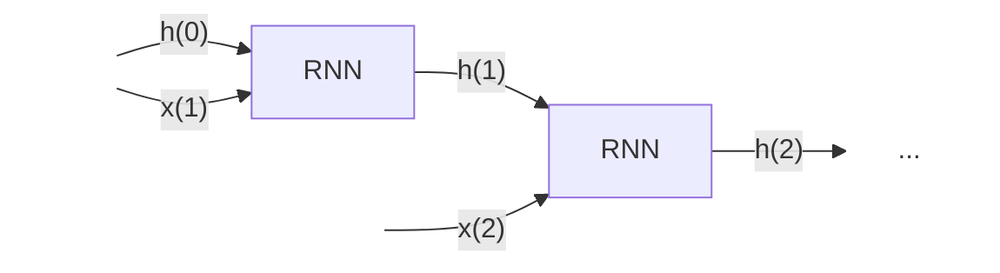

```mermaid
graph LR;
    START[ ] -->|"h(0)"| B[RNN];
    START[ ] -->|"x(1)"| B;
    B -->|"h(1)"| E[RNN]
    START2[ ] -->|"x(2)"| E
    E -->|"h(2)"| STOP[...]

    style START fill-opacity:0, stroke-opacity:0;
    style START2 fill-opacity:0, stroke-opacity:0;
    style STOP  fill-opacity:0, stroke-opacity:0;
```